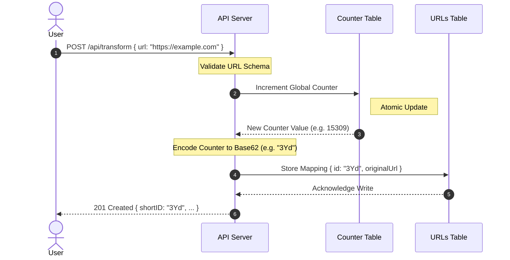
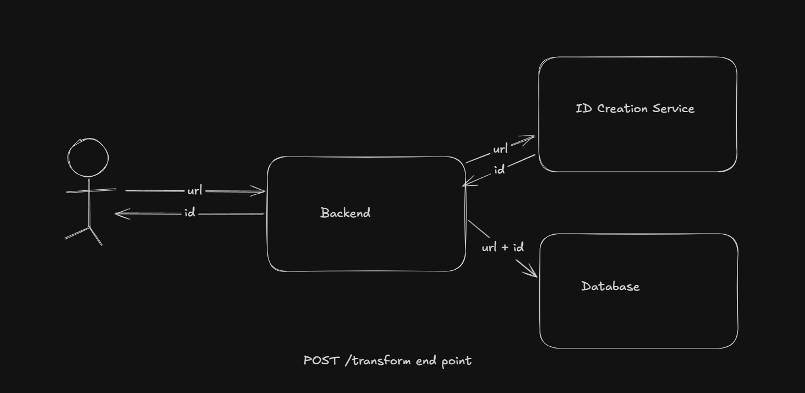
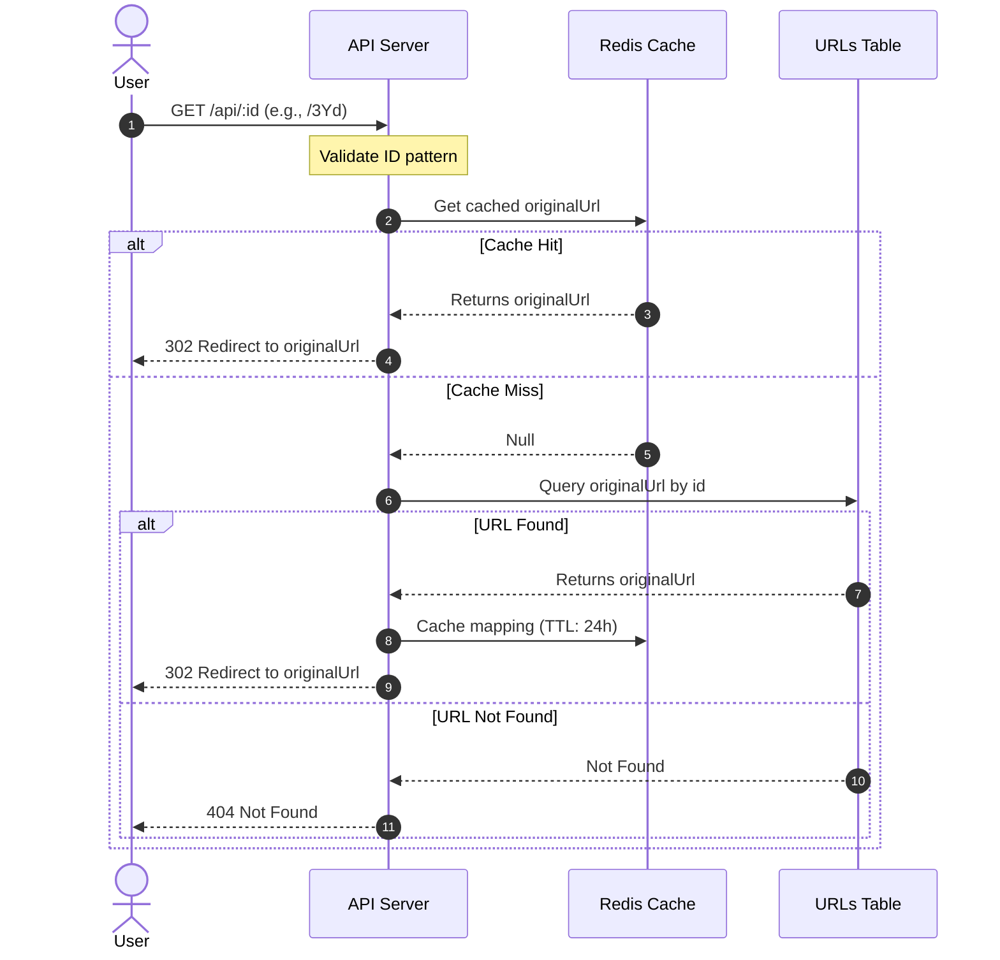
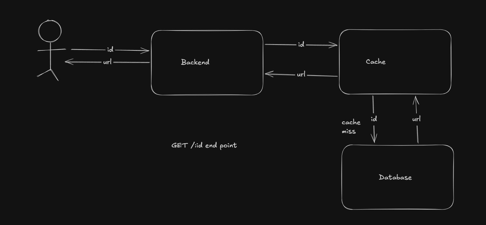

# URL Shortener Service

This is a fast, robust, and highly scalable URL shortener API. It utilizes a persistent database for data persistence and atomic counter increments, an in-memory caching layer for sub-millisecond redirect performance, and strict input schema validation.

---

## Architecture & Workflows

The service leverages atomic counter-based key generation combined with base62 encoding. Below are the workflows for the two primary endpoints.

### 1. POST `/api/transform` (Short ID Creation)
When a user requests a short URL, the system atomically increments a persistent database counter to generate a unique sequential ID, encodes it into a compact Base62 representation, and persists the mapping.





---

### 2. GET `/api/:id` (Redirection & Cache Lookup)
When a short URL is accessed, the system checks the redirection cache first for sub-millisecond performance. In the event of a cache miss, it queries the database and updates the cache with a 24-hour Time-to-Live (TTL).





---

## Key Features

- **Base62 Encoding:** Encodes unique autoincremented numbers using `0-9a-zA-Z` (yielding shorter IDs than hashes or UUIDs).
- **Atomic Counter Generation:** Uses atomic database counter updates, preventing collisions under heavy concurrent load.
- **Caching Layer:** Integrates an in-memory cache to serve redirection requests at memory speed, offloading database read traffic.
- **Fail-safe Schema Validation:** Strict runtime parsing of URLs and IDs via request validation.
- **Global Error Handling:** Consistent central error middleware formatting all API failures as neat JSON responses.

---

## Tech Stack

- **Runtime:** Node.js (ES Modules)
- **Framework:** Express.js (v5)
- **Database:** Amazon DynamoDB (using AWS SDK v3)
- **Caching:** Redis
- **Validation:** Zod
- **Environment Management:** dotenv & Zod schema validation

---

## Project Structure

```text
URL Shortener/
├── assets/                  # Documentation images and diagrams
│   └── README.md            # Asset instructions
├── config/
│   ├── cleanedenv.js        # Environment schema parsing and validation
│   ├── dynamodb.js          # Database client initialization
│   └── redis.js             # Cache client initialization & event handler
├── controllers/
│   └── api.controller.js    # Route controllers (transformUrl, getId)
├── middlewares/
│   ├── errorHandler.middleware.js # Global JSON error handling middleware
│   ├── idValidation.middleware.js # Schema validation for shortID path parameters
│   └── urlValidation.middleware.js # Schema validation for original URL body fields
├── repositories/
│   ├── counter.repository.js# Atomic increment operations on Database counter table
│   └── urls.repository.js   # Read/Write operations on Database URLs table
├── routes/
│   └── api.routes.js        # API routing configuration
├── utils/
│   ├── ApiError.js          # Unified API custom error wrapper
│   ├── ApiResponse.js       # Unified API success response formatter
│   ├── asyncHandler.js      # Async controller wrapper to catch errors
│   └── base62.js            # Decimal-to-Base62 encoder implementation
├── app.js                   # Application-level middlewares configuration
├── index.js                 # Entry point (connects Cache & runs listener)
└── package.json             # Project dependencies and details
```

---

## Getting Started

### Prerequisites
- **JavaScript Runtime** (v18+ recommended)
- **Cache Server** running instance (locally or cloud-hosted)
- **Database Service** access/credentials

### 1. Database Setup
Create two tables in your database:
1. **URLs Table**: Primary Key should be `id` (String).
2. **Counter Table**: Primary Key should be `counter` (String).
   - Insert an initial document into this table to boot the counter:
     ```json
     {
       "counter": "url_counter",
       "value": 0
     }
     ```

### 2. Environment Configuration
Create a `.env` file in the root directory and configure the environment variables required by the environment schema (`config/cleanedenv.js`):
```env
PORT=3000
REDIS_URL=redis://localhost:6379

AWS_REGION=us-east-1
AWS_ACCESS_KEY_ID=your_access_key
AWS_SECRET_ACCESS_KEY=your_secret_access_key

URLS_TABLE=ShortUrlsTable
COUNTER_TABLE=CountersTable
COUNTER_KEY=url_counter
```

### 3. Installation & Run
Install dependencies and start the application server:
```bash
# Install dependencies
npm install

# Start the server
node index.js
```

---

## API Documentation

### 1. Shorten a URL
- **Endpoint:** `POST /api/transform`
- **Content-Type:** `application/json`
- **Request Body:**
  ```json
  {
    "url": "https://example.com/very/long/path/to/some/page"
  }
  ```
- **Success Response (201 Created):**
  ```json
  {
    "statusCode": 201,
    "data": {
      "shortID": "3Yd",
      "originalUrl": "https://example.com/very/long/path/to/some/page"
    },
    "message": "Success",
    "success": true
  }
  ```

### 2. Redirect to Original URL
- **Endpoint:** `GET /api/:id`
- **Success Response (302 Found):**
  - Redirects user directly to the original target URL.
- **Error Response (404 Not Found):**
  ```json
  {
    "statusCode": 404,
    "message": "URL not found",
    "success": false
  }
  ```
